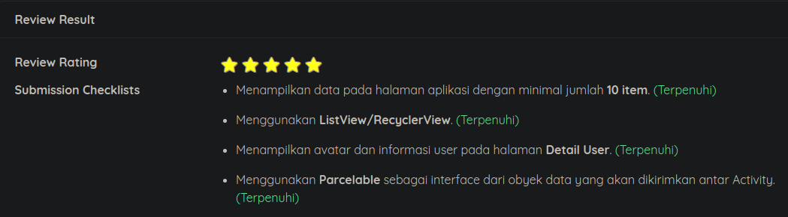
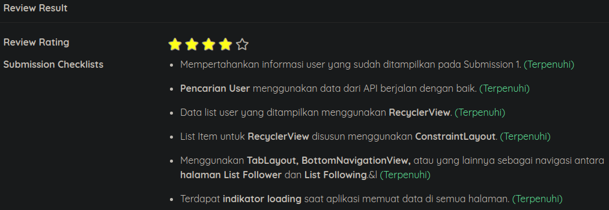

# Submission BFAA Dicoding

Min. SDK Lolipop | 5.0

## Submission 1

Requirements:
1. Show 10 items at Main Page / Activity.
1. Use Parcelable for Intent between Activity.
1. Use ListView for list
1. Detail Page contains basic Information (Username, Name, Avatar)

Recommendation:
1. Good UI / Layouting.
1. Clean code, identation, import usage.
1. Use RecyclerView
1. Detail Page contains all information.
1. Splash Screen, share button, etc.

## Submission 2

Requirements:
1. Search Page:
    - Search user by API
    - From search result, app user can go to Detail User
    - List use RecyclerView
    - RecyclerView use ConstraintLayout

2. Detail User:
    - Use page as Submission 1
    - Show fragment contain list follower and following from API
    - Use TabLayout, BottomNavigationView, other to navigate list

3. Load Indicator while load data.

Recommendation:
1. Good UI / Layout
1. Use SearchView for search feature.
1. Clean Code
1. Implement LiveData
1. Localization (Indonesia & English)
1. MVVM
